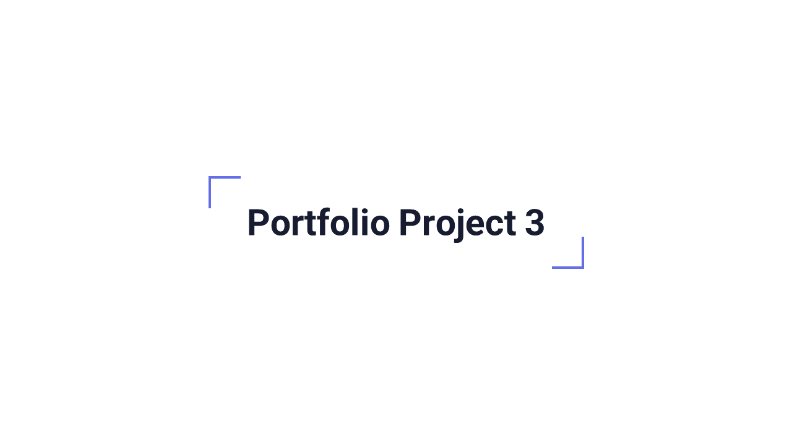
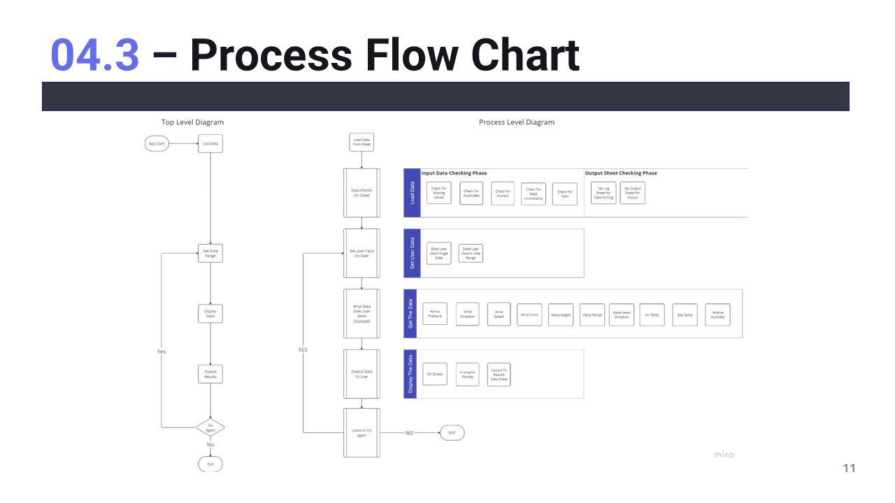

# GaelForce - Marine Weather Data Analysis App

GaelForce is command line marine specific data analysis app focused on the sailing community.
Its data is real life, historical weather data, captured from one of the weather buoys located
around the Irish cost and is part of the Irish weather buoy network.

Refered to as M2 by the Marine Institue, the M2 Weather buoy records hourly environmental data
that can be used by the sailing community, competitive and leisure, to interrogate the data
and see what weather conditions were like on given date ranges.

This data, compared to current predictions, could give advantage to competitors in planning their
strategy for an event on a given date.

The link to the live GaelForce app  is here: [GaelForce](https://gaelforce-db2972ea6536.herokuapp.com/)

A Link to the live, Irish Weather Buoy Network (IMOS) is here: [IMOS](https://www.marine.ie/site-area/data-services/real-time-observations/irish-weather-buoy-network-imos)

M2 BUOY POSITION:  53.4800°N 05.4250°W

---

## The Approach I Took

Intro

Agenda

Project Introduction

The Problem I Solve

Target Audience

Persona 1

User Story - Silas The Mariner

Proposed Solution

I Will Deliver

---

## User Stories

As a competive sailor: 

Im always looking for an edge on my competition. I spend hours pouring over weather models trying to predict what the weather will bring, during a specific event. 

As a sailor, it would really benefit me:

- If I could find a reliable source of weather data
- be sure the data was clean, void of errors for my calculations
- allow me interrogate the data based on a date range
- allow me select the particular data im interested in:
    - Atmospheric Pressure
    - Wind Direction
    - Wind Speed
    - Wind Gusts
    - Wave Height
    - Wave Period
    - Mean Wave Direction
    - Air Temperature
    - Sea Temperature
    - Relative Humidity

- I Also want to be able to view categorised subsets of the data:
    - Atmospheric Pressure
    - Wind Related Set
    - Wave Related Set
    - Temperature Related Set

- I Want to have options, where suitable to output the resulting data set:
    - To the console
    - To a worksheet
    - To a data graph

As the app creator:

It would benefit me if I could see that the relevant session data could be output to a worksheet so I could ensure that any errors that could aid bugfixing or future enhancements could be trapped.

---

## Logic Flow

The basic logic flow of the app is:

- Load the data set
    - validate the data:
        - Check for missing data
        - Check for duplicates
        - Check for outliers
        - Check for date inconsistancies

- Allow user select date range
- Allow user select data set for interrogation
- Allow user select data output format

- Data input:
    - console
    - master data sheet

- Data output:
    - Session log - data sheet
    - Error log - data sheet
    - Atmospheric outliers - data sheet
    - Wind outliers - data sheet
    - Temp outliers - data sheet
    - Date-Time error log - data sheet
    - Graphical output - data sheet - chart

---

## Features And Benefits

---

## Functions

---

## Given Time I Would Implement

---

## Deployment

---

## Cloning

---

## Credits

---

## Testing

---

## Code Validation

---

## Bugs

---