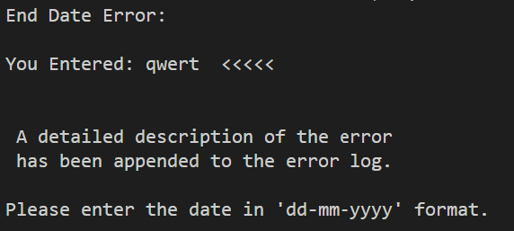

# GaelForce - Marine Weather Data Analysis App

GaelForce is command line marine specific data analysis app focused on the sailing community.
Its data is real life, historical weather data, captured from one of the weather buoys located
around the Irish cost and is part of the Irish weather buoy network.

Refered to as M2 by the Marine Institue, the M2 Weather buoy records hourly environmental data
that can be used by the sailing community, competitive and leisure, to interrogate the data
and see what weather conditions were like on given date ranges.

This data, compared to current predictions, could give advantage to competitors in planning their
strategy for an event on a given date.

The link to the live GaelForce app  is here: [GaelForce](https://gaelforce-db2972ea6536.herokuapp.com/)

A Link to the live, Irish Weather Buoy Network (IMOS) is here: [IMOS](https://www.marine.ie/site-area/data-services/real-time-observations/irish-weather-buoy-network-imos)

M2 BUOY POSITION:  53.4800°N 05.4250°W

---

## The Approach I Took

Intro

Agenda

Project Introduction

The Problem I Solve

Target Audience

Persona 1

User Story - Silas The Mariner

Proposed Solution

I Will Deliver

---

## User Stories

As a competive sailor: 

Im always looking for an edge on my competition. I spend hours pouring over weather models trying to predict what the weather will bring, during a specific event. 

As a sailor, it would really benefit me:

- If I could find a reliable source of weather data
- be sure the data was clean, void of errors for my calculations
- allow me interrogate the data based on a date range
- allow me select the particular data im interested in:
    - Atmospheric Pressure
    - Wind Direction
    - Wind Speed
    - Wind Gusts
    - Wave Height
    - Wave Period
    - Mean Wave Direction
    - Air Temperature
    - Sea Temperature
    - Relative Humidity

- I Also want to be able to view categorised subsets of the data:
    - Atmospheric Pressure
    - Wind Related Set
    - Wave Related Set
    - Temperature Related Set

- I Want to have options, where suitable to output the resulting data set:
    - To the console
    - To a worksheet
    - To a data graph

As the app creator:

It would benefit me if I could see that the relevant session data could be output to a worksheet so I could ensure that any errors that could aid bugfixing or future enhancements could be trapped.

---

## Logic Flow

The basic logic flow of the app is:

- Load the data set
    - validate the data:
        - Check for missing data
        - Check for duplicates
        - Check for outliers
        - Check for date inconsistancies

- Allow user select date range
- Allow user select data set for interrogation
- Allow user select data output format

- Data input:
    - console
    - master data sheet

- Data output:
    - Session log - data sheet
    - Error log - data sheet
    - Atmospheric outliers - data sheet
    - Wind outliers - data sheet
    - Temp outliers - data sheet
    - Date-Time error log - data sheet
    - Graphical output - data sheet - chart

---

## Features And Benefits
### Google sheet initialisation

- During the Google sheet initialisation process, there are checks carried out for I/O purposes on the sheets.
    - Validation carried out
        - File not found
        - Permission error
        - IO error

- On app load, the worksheet storing the Master data input worksheet is loaded and the output sheets are cleared.

The link to the Google worksheet being used for the project is: [marine_data_m2](https://docs.google.com/spreadsheets/d/1cjDvLdeYgYip8yfg4w531LKcoRlo8t8gb8esrI30H6U/edit?usp=sharing)

### Worksheets being used

INPUT:

| Sheet Name  |   Link  | Function |
|------------|----------------|--------------|
|       marine_data_master_data_2020_2024    |   [marine_data_master_data_2020_2024](https://docs.google.com/spreadsheets/d/1cjDvLdeYgYip8yfg4w531LKcoRlo8t8gb8esrI30H6U/edit?usp=sharing)  | Master Data Set For Running The App |

OUTPUT:

| Sheet Name  |   Link  | Function |
|------------|----------------|----------------|
|       validated_master_data    |   [validated_master_data](https://docs.google.com/spreadsheets/d/1cjDvLdeYgYip8yfg4w531LKcoRlo8t8gb8esrI30H6U/edit?usp=sharing178716219)  | Validated Data Set - Ready For User Interrogation |
|       user_data_output    |   [user_data_output](https://docs.google.com/spreadsheets/d/1cjDvLdeYgYip8yfg4w531LKcoRlo8t8gb8esrI30H6U/edit?usp=sharing911199205)  |   Worksheet Used If User Wishes To Output Results To Data Sheet For Review |
|       session_log    |   [session_log](https://docs.google.com/spreadsheets/d/1cjDvLdeYgYip8yfg4w531LKcoRlo8t8gb8esrI30H6U/edit?usp=sharing410413428)  | Worksheet Used To Log Session Info - Used For Verifying Steps Progression Through App |
|       gael_force_error_log    |   [session_log](https://docs.google.com/spreadsheets/d/1cjDvLdeYgYip8yfg4w531LKcoRlo8t8gb8esrI30H6U/edit?usp=sharing410413428)  | Worksheet Used For Logging Errors Found During Session |
|       atmos_outliers    |   [atmos_outliers](https://docs.google.com/spreadsheets/d/1cjDvLdeYgYip8yfg4w531LKcoRlo8t8gb8esrI30H6U/edit?usp=sharing410485236)  | Worksheet Used For Outputting Atmospheric Outliers, found during validation|
|       wind_outliers    |   [wind_outliers](https://docs.google.com/spreadsheets/d/1cjDvLdeYgYip8yfg4w531LKcoRlo8t8gb8esrI30H6U/edit?usp=sharing594709402)  | Worksheet Used For Outputting Wind Outliers, found during validation|
|       wave_outliers    |   [wave_outliers](https://docs.google.com/spreadsheets/d/1cjDvLdeYgYip8yfg4w531LKcoRlo8t8gb8esrI30H6U/edit?usp=sharing691663590)  | Worksheet Used For Outputting Wind Outliers, found during validation|
|       temp_outliers    |   [temp_outliers](https://docs.google.com/spreadsheets/d/1cjDvLdeYgYip8yfg4w531LKcoRlo8t8gb8esrI30H6U/edit?usp=sharing697757766)  | Worksheet Used For Outputting Wind Outliers, found during validation|
|       date_time    |   [date_time](https://docs.google.com/spreadsheets/d/1cjDvLdeYgYip8yfg4w531LKcoRlo8t8gb8esrI30H6U/edit?usp=sharing2036646154)  | Worksheet Used For Outputting Date Format Errors, found during validation|
|       graphical_output_data    |   [graphical_output_data](https://docs.google.com/spreadsheets/d/1cjDvLdeYgYip8yfg4w531LKcoRlo8t8gb8esrI30H6U/edit?usp=sharing2079660690)  | Worksheet Used For Graphical Data Of User Selected Data Set|

### Asking the user if they want to continue y/n
- Asking the user if they want to continue or exit allows them exit immediately or continue. It creates a better user experience by providing options.
    - Only y or n are accepted
    - Any other data input is written to the error log

### Data initialisation
- Error and session logs are initialised
- Master data is loaded into dataframe

The benefit is that on each app run, the logs are cleared and you start with a fresh set of data. 
The benefit of having the session and error logs, is for understanding how the data was validated for the user and any errors recorded for the developer and user. The logs include date/time stamps to help understand the message relevance.

### Data Validation
- During the data validation process, checks are carried out for
    - Missing Values
    - Duplicate Rows
    - Outliers
    - Date Inconsistancies

The benefit is that you are removing incomplete and incorrect data which would impact on the reliability of the data output.

### Getting user selected date range
- During the date selection process, the user is asked to input a start date and a finish date, in the format dd-mm-yyyy. They cannot proceed until the correct format is input. They are also given the option to 'quit'. The user is also presented with the earliest date and latest date in the master data set to provide them with a range possible.
    - Date conversion from yyyy-mm-ddTH:M:SZ to dd-mm-yyyy carried out on dataframe
    - Start Date Input and validated
    - End Date Input and validated
    - Errors written to log

The benefit, converting the dataframe date format allows a consistant key for interrogating the data. Selecting only the dd-mm-hhhh part of the date field allows the data be selected for complete dates. While the master data is updated on an hourly basis, it may be add too much complexity for the user to input dd-mm-hhhh-h-m-s for selecting dates on a command line.

### Get Data Selection
- Durning Data selection the user is presented with the data selection criteria.
    - All Data Available
    - Just Atmospheric Pressure Related Data
    - Just Wind Related Data, Speed And Gusts
    - Just Wave Related Data, Height, Period, Mean Direction
    - Temperature, Wind, Sea

The benefit of allowing the user select which data set they want returned is that they can get some level of granularity based on their interest.
They may be able to consume all the data set or may just be interested in the Wind specific data, or any specific set which would feed into their race strategy. Atmospheric pressure can imply a weather front coming in with change, while wind specific data can allow them implement a startline strategy. They may well want to take all the data set validated for a range and output it for input to another app they have.

### Get output selection
- During the get output selection process there are three output options:
    - Console - screen
    - Chart - Graph
    - Sheet - Worksheet

- For the purpose of the deployment to heroku the ouptut to screen option is limited to data sets with less than 30 rows. The current master data set has over 32,000 so that would not create a positive user experience with it output to the screen.

---

## Run The App

| Description  |  Screenshot |
|------------|----------------|
| On the first visit to the heroku interface click on start program button |         |
| You will be asked if you want to continue y/n |         |
| You will be asked to input a start date |         |
| You will be asked to input a end date |         |
| You will be asked to select the data you want to output |         |
| You will be asked to select the output format you want.   Note, you will not be offered "Print To Screen" if there are more than 30 rows of data  |         |

The option to limit the "print to screen option" to 30 rows is based on the headless client that we have on heroku. With over 32,000 rows of data available in this master data set, it would create a negative user experience to have them print to screen. The data set, can however be output to sheet and chart.
 

## Functions

### `main()` Function Overview

The `main()` function is the central hub of this application, orchestrating its overall functionality. Below is a breakdown of what this function does:

Expand `main()` 

#### Functionality

1. **User Interaction**: 
   - The function begins by prompting the user to decide whether to continue or exit the application.

2. **Data Initialization and Validation**:
   - It initializes the master data from external sources (e.g., Google Sheets).
   - The data is then validated to ensure it meets the necessary criteria.

3. **Validation Check**:
   - If the data validation fails, the application will notify the user and terminate. If successful, it proceeds to the next steps.

4. **Date Formatting**:
   - The function formats the date columns of the validated data frame to a standardized `dd-mm-yyyy` format.

5. **User-Specified Date Range**:
   - The user is prompted to specify a date range for filtering the data. If the user chooses to cancel, the application exits.

6. **Data Filtering**:
   - The data frame is filtered based on the date range provided by the user.

7. **Data Display Formatting**:
   - The filtered data frame is formatted for display purposes, again ensuring the date format is `dd-mm-yyyy`.

8. **Column Selection**:
   - The user can select specific data columns they are interested in viewing or analyzing.

9. **Output Options**:
   - Depending on the number of rows in the selected data, the function determines the output options available (e.g., screen display, graphs, or exporting to a sheet).

10. **Output Generation**:
    - Based on the user's preferences and selections, the application generates the desired output.

11. **Error Logging**:
    - If any errors occur during the session, they are logged and written to an error log sheet.

#### Error Handling

- The function maintains an `error_log_data` list to store any errors encountered during execution.
- At the end of the session, if there are any logged errors, they are updated in the external error log sheet for further review.

#### Conclusion

The `main()` function ensures that the application runs smoothly by handling user interactions, data processing, and error management in a systematic and user-friendly manner.

 
 

---

##  Google Sheet Initialisation

### `check_google_sheet_access` Function Overview

The `check_google_sheet_access(credentials_path, sheet_name)` function is responsible for verifying the accessibility of a specified Google Sheet using a service account's credentials. Here's a detailed breakdown of its functionality:

Expand `check_google_sheet_access(credentials_path, sheet_name)` 

#### Functionality

1. **Arguments**:
   - `credentials_path (str)`: The file path to the JSON file containing the service account credentials.
   - `sheet_name (str)`: The name of the Google Sheet that the function will attempt to access.

2. **Returns**:
   - If successful, the function returns a `gspread.models.Worksheet` object representing the first worksheet in the specified Google Sheet.
   - If any error occurs, it returns `None`.

#### Workflow

1. **Scope Definition**:
   - The function begins by defining the OAuth2 scope required to access Google Sheets and Google Drive.

2. **Credentials Loading**:
   - The function attempts to load the service account credentials from the provided `credentials_path`.

3. **Google Sheet Access**:
   - Using the authorized credentials, the function attempts to access the specified Google Sheet by name and opens the first worksheet within it.

4. **Success**:
   - If the Google Sheet is accessed successfully, the function prints a success message and returns the first worksheet object.

#### Error Handling

The function includes comprehensive error handling to manage different scenarios:

- **FileNotFoundError**:
  - Occurs if the specified credentials file does not exist. The function informs the user and prints the error details.

- **PermissionError**:
  - Occurs if there is an issue with permissions when accessing the credentials file. The function provides an error message and details.

- **SpreadsheetNotFound**:
  - Raised when the specified Google Sheet does not exist. The function catches this exception and notifies the user.

- **APIError**:
  - If there is an API-related issue during the sheet access attempt, the function catches it and prints the relevant error details.

- **IOError**:
  - Handles any input/output errors that might occur during the process.

- **General Exception**:
  - Catches any other unexpected errors and prints their details.

#### Conclusion

The `check_google_sheet_access` function is a critical utility that ensures the application can access the necessary Google Sheets using provided credentials. It handles a variety of potential issues gracefully, providing clear feedback on what went wrong if access fails.

 

### `initialise_google_sheets` Function Overview

The `initialise_google_sheets()` function is designed to prepare the application for a new session by clearing all data in the relevant Google Sheets. This ensures that the application starts with a clean slate each time it runs.

Expand `initialise_google_sheets()` 

#### Functionality

1. **Purpose**:
   - This function clears the data in specific Google Sheets used by the application. It is invoked at the beginning of each session to reset the necessary sheets.

2. **Google Sheet Access**:
   - The function first checks for access to a Google Sheet named `marine_data_m2` using credentials stored in a file called `creds.json`.

3. **Sheet Initialization**:
   - If access is successful, the function prints a message indicating the start of the Google Sheets initialization process.
   - It then lists the Google Sheets that need to be cleared and iterates through each one, invoking the `clear()` method to remove any existing data.

#### Workflow

1. **Initialization Message**:
   - The function begins by printing messages to the console, indicating that it is starting the initialization process.

2. **Google Sheet Access**:
   - The function calls `check_google_sheet_access('creds.json', 'marine_data_m2')` to access the necessary Google Sheet. 
   - It prints the link to the Google Sheet for reference.

3. **Clearing Sheets**:
   - The function then defines a list of Google Sheets, including:
     - `validated_master_data`
     - `user_data_output`
     - `session_log`
     - `error_log`
     - `atmos_outlier_log`
     - `wind_outlier_log`
     - `wave_outlier_log`
     - `temp_outlier_log`
     - `date_time__error_log`
     - `graphical_output_sheet`
   - Each sheet in this list is cleared of any existing data using the `clear()` method.

4. **Completion Message**:
   - Once all the sheets have been cleared, the function prints a completion message indicating that the Google Sheets initialization process is finished.

#### Conclusion

The `initialise_google_sheets` function is a crucial preparatory step in the application, ensuring that all relevant Google Sheets are cleared of previous data before each new session. This guarantees that the application operates with fresh data, avoiding any potential issues related to leftover information from previous runs.

---

 
 

## Get User Input - Do You Want To Continue

### `get_continue_yn` Function Overview

The `get_continue_yn()` function is responsible for introducing the user to the application and determining whether they wish to proceed or exit. It manages user input, ensuring that only valid responses are accepted, and handles errors appropriately.

Expand `get_continue_yn()` 

#### Functionality

1. **Introduction**:
   - The function starts by displaying a welcome message that introduces the two main components of the application:
     - **Data Validation**
     - **Data Interrogation**

2. **User Prompt**:
   - The function prompts the user with a simple question: "Do you want to continue? (y/n)".
   - The user's input is expected to be either 'y' (to continue) or 'n' (to exit).

3. **Input Handling**:
   - If the user inputs 'y', the function returns 'y' and the application continues.
   - If the user inputs 'n', the function prints an exit message and terminates the application.
   - If the user inputs anything else, a `ValueError` is raised, and the user is prompted again.

4. **Error Logging**:
   - The function logs any invalid input in an error log, along with a timestamp and a detailed description of the error.
   - The user is informed of the error and asked to enter a valid input again.

5. **Returns**:
   - The function returns the user's response ('y' to continue or 'n' to exit).

### Workflow

1. **Introduction Message**:
   - The function begins by printing an introduction message to the user, explaining the purpose of the application.

2. **User Input Loop**:
   - The function enters a loop where it continuously prompts the user to decide whether to continue or exit.

3. **Input Validation**:
   - Inside the loop, the function checks the user's input:
     - If the input is valid ('y' or 'n'), the appropriate action is taken.
     - If the input is invalid, the function logs the error, informs the user, and repeats the prompt.

4. **Error Handling**:
   - Any invalid input triggers a `ValueError`, which is logged with details such as the timestamp and the erroneous input.

5. **Exit or Continue**:
   - If the user decides to exit by entering 'n', the function gracefully terminates the application.

#### Conclusion

The `get_continue_yn` function plays a crucial role in managing the user experience at the start of the application. By handling user input robustly and logging errors, it ensures that the application only proceeds when the user is ready and provides clear feedback when issues arise.

 
 

---

## Data Validation

### `data_initialisation_and_validation` Function Overview

The `data_initialisation_and_validation()` function is a key part of the application, responsible for loading and validating marine data. It ensures that the data is properly validated before being used throughout the session, and it is only executed once per session.

Expand `data_initialisation_and_validation()` 

#### Functionality

1. **Data Loading**:
   - The function begins by loading the marine data required for validation. This data is crucial for the subsequent operations of the application.

2. **Data Validation**:
   - Once the data is loaded, the function validates it to ensure that it meets the necessary criteria for analysis.
   - Validation involves checking the integrity and quality of the data, ensuring that it is free of errors and inconsistencies.

3. **Session Data Storage**:
   - The validated data is then stored in a data frame (`validated_df`), which will be used throughout the session for various operations.
   - This step is critical as it ensures that only clean and accurate data is used in the application.

4. **Single Execution per Session**:
   - The function is designed to run only once per session, as the validated data remains consistent throughout the session.

5. **Returns**:
   - The function returns the `validated_df`, which contains the cleaned and validated data ready for use in the application.

#### Workflow

1. **Initialization Message**:
   - The function starts by printing a message indicating the beginning of the data validation process, signaling to the user that Phase 1 has started.

2. **Data Loading**:
   - The function loads the marine data by calling `load_marine_data_input_sheet()`. This step retrieves the necessary data along with session log and error log data.

3. **Data Validation**:
   - The loaded data is then passed to the `validate_master_data()` function, which performs the actual validation. The session log and error log data are also updated during this process.

4. **Return Validated Data**:
   - After validation, the function returns the `validated_df`, which contains the data that passed the validation checks.

#### Conclusion

The `data_initialisation_and_validation` function is essential for preparing the application to work with accurate and validated data. By loading and validating the marine data at the start of each session, it ensures that the subsequent analyses and operations are based on reliable information, thereby enhancing the overall robustness of the application.

 

### `load_marine_data_input_sheet` Function Overview

The `load_marine_data_input_sheet()` function is responsible for initializing session and error logs and loading the master data from a Google Sheet. This function is crucial for setting up the necessary data structures and logs at the beginning of each session.

Expand `load_marine_data_input_sheet()` 

#### Functionality

1. **Session and Error Log Initialization**:
   - The function begins by initializing the session log and error log, which are used to track the session's progress and log any errors that occur.

2. **Master Data Loading**:
   - The function then loads the master data from the Google Sheet into a data frame. This data serves as the foundation for the application's operations during the session.

3. **Logging**:
   - As part of the process, the function logs the start and completion times for loading the master data, updating both the session log and error log accordingly.

4. **Returns**:
   - The function returns three objects:
     - `master_data`: A data frame containing all the data from the master data Google Sheet.
     - `session_log_data`: A list containing the session log details, including timestamps.
     - `error_log_data`: A list containing the error log details, including timestamps.

#### Workflow

1. **Log Initialization**:
   - The function starts by printing messages to indicate the opening of the session and error logs. It also prints the URLs for these logs.
   - It initializes the session log and error log as lists containing the log start message and the current timestamp.

2. **Master Data Loading**:
   - The function prints a message indicating the beginning of the master data loading process.
   - It adds a timestamped entry to the session log to record when the master data loading started.
   - The function then loads the data from the Google Sheet into the `master_data` data frame.
   - After loading, it updates the session log with another timestamped entry to indicate that the loading is complete.

3. **Return Values**:
   - Finally, the function returns the `master_data`, along with the `session_log_data` and `error_log_data` lists.

#### Conclusion

The `load_marine_data_input_sheet` function is essential for initializing the session's data environment. By setting up the session and error logs and loading the master data, it ensures that the application starts with the necessary data structures and that all subsequent operations are properly logged and monitored.

 

### `validate_master_data` Function Overview

The `validate_master_data()` function is responsible for validating and cleaning the marine data set. It performs several data validation checks to ensure the data is accurate and ready for analysis. The function also logs each step of the validation process, updating both session and error logs.

Expand `validate_master_data()` 

### Functionality

1. **Initialization**:
   - The function initializes empty lists for logs, including `session_log_data`, `error_log_data`, and `date_time_error_log_data`.
   - It starts by printing a message indicating the beginning of the data validation process.

2. **Data Frame Creation**:
   - The raw data from `master_data` is converted into a Pandas DataFrame.
   - The function extracts specific columns relevant to the application and creates a working DataFrame (`master_df`) with these columns.

3. **Validation Steps**:
   - **Missing Values**:
     - Identifies and logs rows with missing values, replacing them with `NaN`.
     - Removes rows with missing data and updates the logs.
   - **Duplicate Rows**:
     - Detects and logs any duplicate rows.
     - Removes duplicates from the data set.
   - **Outliers**:
     - Identifies outliers in numerical columns such as `AtmosphericPressure`, `WindSpeed`, `WaveHeight`, and temperatures.
     - Logs outliers in separate logs specific to each data type (e.g., Atmospheric, Wind, Wave, Temp).
   - **Date Inconsistencies**:
     - Validates and corrects the date and time format to ensure compliance with ISO 8601 standards.
     - Logs any rows with date format issues and attempts to correct them.

4. **Logging**:
   - The function updates session and error logs throughout the validation process.
   - All log entries are converted to strings for consistency.

5. **Error Handling**:
   - If an error occurs during the validation process, it is caught, logged, and the function continues to execute the final log updates.

6. **Log Updates**:
   - The function calls `update_all_logs()` to update all relevant logs in Google Sheets.

7. **Final Steps**:
   - After validation, the cleaned and validated data (`validated_data_df`) is written back to Google Sheets.
   - A message is printed to indicate the completion of the data validation process and where the validated data can be found.

8. **Returns**:
   - The function returns the `validated_data_df`, which contains the cleaned and validated data ready for further analysis.

#### Workflow

1. **Start Validation**:
   - The function starts with initializing logs and converting raw data into a DataFrame for easier manipulation.

2. **Validation Procedures**:
   - The function systematically validates the data by checking for missing values, duplicates, outliers, and date inconsistencies.
   - Each step is carefully logged to ensure traceability.

3. **Error Handling and Logging**:
   - Errors during the process are handled gracefully, with detailed logging to help identify issues.

4. **Final Output**:
   - The validated data is written back to a Google Sheet, and the function concludes by returning the validated DataFrame.

#### Conclusion

The `validate_master_data` function is crucial for ensuring the integrity of the marine data before it is used in the application. By performing comprehensive checks for missing values, duplicates, outliers, and date inconsistencies, the function guarantees that only clean, reliable data is utilized, thereby enhancing the accuracy and reliability of subsequent analyses.

 

### `validate_missing_values` Function Overview

The `validate_missing_values()` function is responsible for identifying and handling missing values in the provided marine data DataFrame (`master_df`). It performs a thorough check for missing data, logs any issues found, and removes rows with missing values to ensure the dataset is clean before further processing.

Expand `validate_missing_values()` 

#### Functionality

1. **Initialization**:
   - The function begins by printing a message indicating the start of the missing values validation process.
   - It logs the start of the missing values check by appending relevant entries to the `session_log_data`.

2. **Handling Missing Values**:
   - The function replaces any instances of `'nan'`, `'NaN'`, or empty strings (`''`) in the `master_df` with `NaN` (Not a Number) using `numpy`.
   - It then calculates the number of missing values in each column by calling `isnull().sum()` on the DataFrame.

3. **Logging Detected Missing Values**:
   - If missing values are detected, the function:
     - Prints a message indicating that rows with missing values were found.
     - Logs the occurrence of missing values in both the `session_log_data` and `error_log_data`.
     - Iterates through the columns with missing values, appending the column name and the count of missing values to the `error_log_data`.

4. **No Missing Values Detected**:
   - If no missing values are found, the function:
     - Prints a message indicating that no rows with missing data were detected.
     - Logs this outcome in the `session_log_data`.

5. **Removing Rows with Missing Values**:
   - If any missing values are detected, the function proceeds to remove the rows containing them from the DataFrame.
   - It logs this removal process in the `session_log_data`.
   - The cleaned DataFrame, `missing_values_removed_df`, is created by dropping all rows with missing values using the `dropna()` method.

6. **Completion**:
   - The function prints a message indicating the completion of the missing values validation process.
   - The cleaned DataFrame (`missing_values_removed_df`), which no longer contains any missing values, is returned.

#### Workflow

1. **Start Validation**:
   - The function initializes logs and prepares the DataFrame by replacing known placeholders for missing values with `NaN`.

2. **Detection of Missing Values**:
   - The function checks each column for missing values, logging any occurrences in both session and error logs.

3. **Removal of Missing Values**:
   - If missing data is found, the corresponding rows are removed from the DataFrame, and this action is logged.

4. **Final Output**:
   - The function returns a cleaned DataFrame that has all rows with missing values removed.

#### Conclusion

The `validate_missing_values` function is a critical step in the data cleaning process, ensuring that the dataset used in the application is free from missing data. By systematically identifying and removing rows with missing values, the function helps maintain the integrity and reliability of the dataset, which is essential for accurate data analysis.

 

### `validate_duplicates` Function Overview

The `validate_duplicates()` function is designed to identify and handle duplicate rows in the provided DataFrame (`missing_values_removed_df`). It ensures that the dataset is free from any redundant data, which is crucial for maintaining the accuracy of the analysis. The function logs any duplicates found and removes them from the dataset.

Expand `validate_duplicates()` 

#### Functionality

1. **Initialization**:
   - The function begins by printing a message indicating the start of the duplicates validation process.

2. **Duplicate Detection**:
   - The function checks for duplicate rows in the `missing_values_removed_df` DataFrame using the `duplicated()` method. 
   - The `keep=False` parameter ensures that all occurrences of duplicate rows are flagged.
   - The total number of duplicate rows found is stored in the variable `duplicates_found`.

3. **Logging Detected Duplicates**:
   - If duplicates are found:
     - A message is printed indicating the number of duplicates found.
     - The function logs this information in both the `session_log_data` and `error_log_data`.
     - It creates a DataFrame, `duplicates_df`, containing all the duplicate rows for detailed logging.
     - The duplicate rows are formatted into a list of lists and appended to the `error_log_data` for more granular tracking.

4. **Removing Duplicate Rows**:
   - The function removes all but the first occurrence of each duplicate row from the DataFrame using the `drop_duplicates()` method.
   - A message is printed indicating that the duplicates have been removed.

5. **No Duplicates Detected**:
   - If no duplicates are found:
     - A message is printed indicating that no duplicates were detected.
     - The function proceeds without making any changes to the DataFrame.

6. **Completion**:
   - The function prints a message indicating the completion of the duplicates validation process.
   - The cleaned DataFrame, now free from duplicate rows, is returned.

#### Workflow

1. **Start Validation**:
   - The function begins by checking the DataFrame for duplicate rows.

2. **Detection of Duplicates**:
   - If duplicates are found, the function logs the number of duplicates and the details of the duplicate rows.

3. **Removal of Duplicates**:
   - The function removes the duplicate rows from the DataFrame, retaining only the first occurrence of each duplicate.

4. **Final Output**:
   - The function returns a cleaned DataFrame with all duplicate rows removed.

### Conclusion

The `validate_duplicates` function plays a crucial role in ensuring data integrity by identifying and removing duplicate rows from the dataset. This step is essential for preventing redundant data from skewing the analysis, thereby contributing to the overall accuracy and reliability of the application.

 

### `validate_outliers` Function Overview

The `validate_outliers()` function is designed to identify and log outliers in a dataset containing marine environmental data. It ensures that any anomalies in key numerical fields are flagged and recorded for further analysis, maintaining the integrity of the dataset used for subsequent processing.

Expand `validate_outliers()` 

#### Functionality

1. **Initialization**:
   - The function starts by printing a message to indicate the beginning of the outlier validation process.
   - It records the start time of the validation in the `session_log_data`.

2. **Data Preparation**:
   - The DataFrame `no_duplicates_df` is converted to a numeric DataFrame `numeric_df`, where each column's values are coerced into numeric types. This ensures that any non-numeric values are converted to `NaN`, facilitating accurate outlier detection.

3. **Outlier Detection**:
   - The function uses the `check_for_outliers()` method to detect outliers across different categories of data:
     - **Atmospheric Pressure**: Checked for outliers in the `AtmosphericPressure` column.
     - **Wind Data**: Checked for outliers in the `WindSpeed` and `Gust` columns.
     - **Wave Data**: Checked for outliers in the `WaveHeight`, `WavePeriod`, and `MeanWaveDirection` columns.
     - **Temperature Data**: Checked for outliers in the `AirTemperature` and `SeaTemperature` columns.

4. **Logging Detected Outliers**:
   - If outliers are detected in any category:
     - The function logs these outliers to the respective outlier sheets (e.g., `atmos_outlier_log`, `wind_outlier_log`, `wave_outlier_log`, and `temp_outlier_log`).
     - It prints a message indicating the presence of outliers and provides the URL to the respective outlier log for further investigation.

5. **Completion**:
   - The function concludes the outlier validation by printing a completion message.

#### Workflow

1. **Start Outlier Validation**:
   - The function begins by recording the start of the outlier validation process.

2. **Convert Data to Numeric**:
   - It converts all relevant data to a numeric format to ensure accurate outlier detection.

3. **Detect Outliers**:
   - The function identifies outliers in atmospheric pressure, wind, wave, and temperature data.

4. **Log Outliers**:
   - Detected outliers are logged in their respective sheets, and URLs to these logs are provided.

5. **Final Output**:
   - The function ends with a message indicating the completion of the outlier validation process.

#### Conclusion

The `validate_outliers` function is a crucial step in ensuring the quality of the dataset by identifying and logging any anomalies in the numerical data. By systematically checking and logging outliers, the function helps maintain the accuracy and reliability of the analysis performed by the application.

 

### `check_for_outliers` Function Overview

The `check_for_outliers()` function identifies outliers in a given DataFrame using the Z-Score method. Outliers are defined as values that significantly deviate from the mean of the data, typically with an absolute Z-Score greater than 3. This function helps in detecting data points that may be statistically significant anomalies.

Expand `check_for_outliers()` 

#### Functionality

1. **Calculate Z-Scores**:
   - Computes the Z-Score for each value in the DataFrame. The Z-Score measures the number of standard deviations a value is from the mean.

2. **Identify Outliers**:
   - Identifies outliers as any value with an absolute Z-Score greater than 3, indicating significant deviation from the mean.

3. **Return Outliers**:
   - Filters and returns a DataFrame containing only the rows identified as outliers.

### Arguments

- **`df`**: The input DataFrame containing numerical data to check for outliers.

#### Workflow

1. **Compute Z-Scores**:
   - Use the `zscore()` function from a statistical library (e.g., SciPy) to calculate Z-Scores for all values in the DataFrame.

2. **Calculate Absolute Z-Scores**:
   - Convert Z-Scores to their absolute values to determine the magnitude of deviation without considering the direction (positive or negative).

3. **Filter Outliers**:
   - Identify rows where any of the absolute Z-Scores are greater than 3. This threshold is commonly used to flag statistically significant outliers.

4. **Return Results**:
   - Return the subset of the DataFrame where outliers have been detected.

#### Conclusion

The `check_for_outliers` function is a valuable tool for detecting anomalies in numerical datasets. By applying the Z-Score method, it identifies data points that deviate significantly from the mean, which could indicate errors, unusual events, or significant variations worth further investigation. This function helps in maintaining the quality and reliability of data by flagging potential outliers for closer scrutiny.

 

### `validate_date_format` Function Overview

The `validate_date_format()` function ensures that the date and time data in a dataset adhere to a specified format. It identifies, logs, and corrects any inconsistencies in date formats, enhancing the quality and consistency of the dataset used for further analysis.

Expand `validate_date_format()` 

#### Functionality

1. **Initialization**:
   - The function begins by printing a message to indicate the start of the date validation process.
   - It logs the start time of the date validation in the `session_log_data`.

2. **Date Format Validation**:
   - The function defines a regex pattern (`date_time_pattern`) to match the expected ISO 8601 date format: `YYYY-MM-DDTHH:MM:SSZ`.
   - It identifies rows where the date format in the `time` column does not match this pattern and stores them in `inconsistent_date_format`.

3. **Handling Date Inconsistencies**:
   - **No Inconsistencies**:
     - If no inconsistencies are found, it prints a confirmation message.
     - Converts the `time` column to the correct date format (`dd-mm-yyyyTHH:MM:SS`) and updates `validated_data_df` with this formatted date.

   - **Inconsistencies Found**:
     - If inconsistencies are detected:
       - Logs the inconsistent date formats to `date_time_error_log_data`.
       - Updates `validated_data_df` with only the rows having the correct date format.
       - Converts the valid `time` values to the correct date format (`dd-mm-yyyyTHH:MM:SS`).

4. **Logging and Final Output**:
   - The function writes the logged inconsistent date formats to the `date_time__error_log`.
   - It prints a message with the URL to the date-time error log for further review.
   - Returns the `validated_data_df` with corrected date formats.

#### Workflow

1. **Start Date Validation**:
   - The function initiates the date validation process and logs the start time.

2. **Validate Date Format**:
   - It checks if the dates in the `time` column conform to the ISO 8601 format using a regex pattern.

3. **Handle and Correct Inconsistencies**:
   - **If Consistent**: Converts the date to `dd-mm-yyyyTHH:MM:SS`.
   - **If Inconsistent**: Logs inconsistencies, filters out incorrect dates, and corrects the remaining dates.

4. **Log and Output**:
   - Writes error logs if inconsistencies are found and provides a link to the log.
   - Returns the DataFrame with validated date formats.

#### Conclusion

The `validate_date_format` function is crucial for ensuring that all date and time entries in the dataset are correctly formatted. By identifying and correcting format issues, the function improves the data's consistency and reliability for subsequent analysis.

---
 
 

## Update Logs

### `update_all_logs` Function Overview

The `update_all_logs()` function is responsible for updating various logs in Google Sheets with the accumulated session, error, and date-time inconsistency data. This function ensures that logs are kept up-to-date with the latest information from the application.

Expand `update_all_logs()` 

#### Functionality

1. **Convert Log Data to DataFrames**:
   - The function converts the `session_log_data`, `error_log_data`, and `date_time_error_log_data` lists into Pandas DataFrames.
   - Each DataFrame is then converted into a list of lists suitable for writing to Google Sheets.

2. **Update Google Sheets**:
   - **Session Log**:
     - Updates the session log in Google Sheets using the `session_log.update` method.
     - Logs session-related data, including the progress and results of various processes.

   - **Error Log**:
     - Updates the error log in Google Sheets using the `error_log.update` method.
     - Logs any errors encountered during the application’s execution.

   - **Date-Time Error Log**:
     - Updates the date-time error log in Google Sheets using the `date_time__error_log.update` method.
     - Logs any inconsistencies related to date and time formatting.

#### Workflow

1. **Convert Logs to DataFrames**:
   - Converts each log list (`session_log_data`, `error_log_data`, `date_time_error_log_data`) into a Pandas DataFrame.
   - Each DataFrame is transformed into a list of lists for compatibility with Google Sheets.

2. **Update Logs in Google Sheets**:
   - **Session Log**: Updates the session log sheet with data from the `session_log_data` DataFrame.
   - **Error Log**: Updates the error log sheet with data from the `error_log_data` DataFrame.
   - **Date-Time Error Log**: Updates the date-time error log sheet with data from the `date_time_error_log_data` DataFrame.

#### Conclusion

The `update_all_logs` function is critical for maintaining accurate and up-to-date logs in Google Sheets. It ensures that session progress, error details, and date-time inconsistencies are recorded and accessible for review and troubleshooting.

 

### `handle_log_update` Function Overview

The `handle_log_update()` function manages I/O operations for updating Google Sheets logs, including error checking and logging. It is designed to automatically append data to the end of a specified sheet, ensuring that new entries are added in the correct position.

Expand `handle_log_update()` 

#### Functionality

1. **Error Handling**:
   - The function initializes an empty list for `error_log_data` if it is not provided.
   - It attempts to perform the update operation and logs any errors encountered.

2. **Determine Last Row**:
   - Calculates the last filled row in the worksheet to determine where to append new data.

3. **Append Data**:
   - Uses the provided `update_function` to append the new data to the sheet starting from the calculated position.

#### Arguments

- **`update_function`**: The function responsible for performing the I/O operation. Typically, this is the `update` method of the Google Sheets worksheet object.
  
- **`worksheet`**: The Google Sheets worksheet object where the data will be updated.
  
- **`data`**: A list of lists containing the data to be written or updated in the sheet.
  
- **`log_name`**: A string specifying the name of the log. This is used for error messages to identify which log is being updated.
  
- **`error_log_data`**: An optional list for storing error messages. If not provided, the function initializes it to an empty list.

#### Workflow

1. **Initialize Error Log Data**:
   - If `error_log_data` is `None`, initialize it as an empty list.

2. **Determine Last Row**:
   - Calculate the last row in the worksheet that contains data using `get_last_filled_row()`.

3. **Calculate Starting Cell**:
   - Determine the starting cell for new data, which is one row below the last filled row.

4. **Update the Worksheet**:
   - Use the `update_function` to append data starting from the calculated cell.

5. **Error Handling**:
   - Catch any exceptions that occur during the update process.
   - Print an error message and append the error details to `error_log_data`.

### Conclusion

The `handle_log_update` function ensures smooth and reliable updates to Google Sheets logs. By managing error checking and handling, it helps maintain accurate and up-to-date records, which are crucial for tracking the application's progress and troubleshooting issues.

---

 
 

## Data Interrogation

### `set_with_dataframe` Function Overview

The `set_with_dataframe` function is used to write a Pandas DataFrame to a Google Sheets worksheet. This function is crucial for updating Google Sheets with validated data, ensuring that the data from a DataFrame is accurately represented in the spreadsheet.

Expand `set_with_dataframe` 

#### Functionality

1. **Convert DataFrame to List**:
   - The function converts the DataFrame into a format that Google Sheets can accept, typically a list of lists.

2. **Update Worksheet**:
   - It writes the converted data to the specified worksheet, replacing any existing data.

#### Arguments

- **`worksheet`**: The Google Sheets worksheet object where the DataFrame will be written. This is typically obtained from the Google Sheets API.

- **`dataframe`**: The Pandas DataFrame that contains the data to be written to the worksheet. This DataFrame is expected to be validated and ready for output.

#### Workflow

1. **Convert DataFrame**:
   - Convert the DataFrame to a list of lists. This step prepares the data for insertion into Google Sheets, where each sublist represents a row.

2. **Write Data**:
   - Use the Google Sheets API to update the worksheet with the converted data. The update process typically starts from cell 'A1', replacing any existing content.

 

### `format_df_date` Function Overview

The `format_df_date()` function is used to convert the format of dates in the `time` column of a DataFrame. It changes the date format from `yyyy-mm-ddTHH:MM:SS` to `dd-mm-yyyy`, aligning with user input preferences for date ranges.

Expand `format_df_date()` 

#### Functionality

1. **Convert DateTime to Date**:
   - The function converts the `time` column from a string format (`yyyy-mm-ddTHH:MM:SS`) to a `datetime` object. This conversion helps in managing and comparing dates more effectively.

2. **Extract Date Component**:
   - After conversion, the function extracts just the date part and formats it as `dd-mm-yyyy`. This results in a new column, `date_only`, which contains the date in the desired format.

#### Arguments

- **`validated_df`**: A Pandas DataFrame containing a `time` column with dates in the format `yyyy-mm-ddTHH:MM:SS`. This column will be transformed into the `dd-mm-yyyy` format.

#### Workflow

1. **Convert `time` Column**:
   - The `time` column is converted to a `datetime` object using `pd.to_datetime()`. The `format` parameter specifies the expected format, and `errors='coerce'` ensures that any parsing errors result in `NaT` (Not a Time).

2. **Extract and Format Date**:
   - A new column, `date_only`, is created by extracting the date component from the `datetime` object and formatting it as `dd-mm-yyyy` using `strftime()`.

#### Conclusion

The `format_df_date` function effectively adjusts the `time` column in a DataFrame to match user input preferences. By converting dates to the `dd-mm-yyyy` format, it simplifies date comparisons and user interactions, making the data more accessible and user-friendly.

 

### `get_user_dates` Function Overview

The `get_user_dates()` function manages user input for selecting a date range based on available data in a DataFrame. It displays the available date range, prompts the user to enter a start date and end date, validates the inputs, and logs any errors encountered during the process.

Expand `get_user_dates()` 

#### Functionality

1. **Display Date Range**:
   - The function displays the range of dates available in the `validated_df` DataFrame, providing context for the user to select appropriate start and end dates.

2. **Prompt and Validate User Input**:
   - It prompts the user to enter a start date and an end date, ensuring that the dates are within the available range and formatted correctly.

3. **Error Logging**:
   - Any errors encountered during date input and validation are logged for further review.

#### Arguments

- **`validated_df`**: A Pandas DataFrame containing a `time` column with date and time data. This DataFrame is used to determine the available date range and validate user input.

#### Workflow

1. **Convert Time Column**:
   - Convert the `time` column in the DataFrame to `datetime` objects for easier comparison and validation.

2. **Display Available Date Range**:
   - Extract and format the earliest and latest dates from the DataFrame. Print this range to the console for user reference.

3. **Prompt for Start Date**:
   - Request the user to input a start date. Validate the input format and ensure the date is within the available range. Log any errors encountered during this process.

4. **Prompt for End Date**:
   - Request the user to input an end date. Validate the input format, ensure the date is within the available range, and check that it is not earlier than the start date. Log any errors encountered during this process.

5. **Convert Dates to String Format**:
   - Convert the validated `start_date` and `end_date` to string format for further processing.

6. **Log Errors**:
   - Use the `handle_log_update` function to append any error details to the error log.

### Conclusion

The `get_user_dates` function facilitates user interaction by allowing the selection of a date range based on the available data. It ensures that input dates are valid and within the specified range, while also handling and logging any errors. This process helps maintain data integrity and improves the user experience by providing clear instructions and feedback.

 

### `filter_data_by_date` Function Overview

The `filter_data_by_date()` function filters a DataFrame to include only the rows that fall within a specified date range. It assumes that the DataFrame contains a `date_only` column formatted as `dd-mm-yyyy`. This function is useful for narrowing down data based on user-defined start and end dates.

Expand `filter_data_by_date()` 

#### Functionality

1. **Date Range Filtering**:
   - The function filters rows based on whether their `date_only` values fall within the specified `start_date` and `end_date` range.

2. **Date Conversion**:
   - Converts the `date_only` column values to `datetime` objects for accurate comparison with the provided date range.

#### Arguments

- **`validated_df`**: A Pandas DataFrame containing a `date_only` column with dates formatted as `dd-mm-yyyy`. This DataFrame is filtered based on the specified date range.

- **`start_date`**: The start date of the range to filter. It can be provided as a `pd.Timestamp` object or a string.

- **`end_date`**: The end date of the range to filter. It can be provided as a `pd.Timestamp` object or a string.

#### Workflow

1. **Convert Date Strings**:
   - Convert the `date_only` column in the DataFrame to `datetime` objects using the format `'%d-%m-%Y'` for accurate comparison.

2. **Filter Data**:
   - Use boolean indexing to filter the DataFrame, including only rows where the date in the `date_only` column falls within the specified `start_date` and `end_date`.

### Conclusion

The `filter_data_by_date` function efficiently narrows down a DataFrame to include only the rows that fall within a user-defined date range. By converting date strings to `datetime` objects, the function ensures accurate filtering and helps in managing data based on temporal criteria.

 

### `format_df_data_for_display` Function Overview

The `format_df_data_for_display()` function is designed to format the `time` column in a DataFrame for display purposes. It ensures that the `time` column, which contains datetime values, is presented in a user-friendly format suitable for viewing and reporting.

Expand `format_df_data_for_display()` 

#### Functionality

1. **Copy DataFrame**:
   - Creates a copy of the input DataFrame to avoid modifying the original data.

2. **Format `time` Column**:
   - Converts the `time` column in the copied DataFrame into a string representation formatted as `dd-mm-yyyy HH:MM:SS`.

#### Arguments

- **`date_filtered_df`**: A Pandas DataFrame containing a `time` column with datetime values. This DataFrame will be formatted for display purposes.

#### Workflow

1. **Create DataFrame Copy**:
   - To prevent changes to the original DataFrame, a copy of `date_filtered_df` is created.

2. **Convert `time` Column Format**:
   - Convert the `time` column in the copied DataFrame to a string format using `strftime('%d-%m-%Y %H:%M:%S')`. This format ensures that datetime values are displayed as `day-month-year hour:minute:second`.

#### Conclusion

The `format_df_data_for_display` function formats datetime values in a DataFrame into a user-friendly string format. By converting the `time` column to a standardized display format, the function ensures that datetime values are presented clearly and are suitable for reporting or presentation.

 

### `get_data_selection` Function Overview

The `get_data_selection()` function prompts users to select data columns they wish to display from a predefined set of options. It provides a menu for users to choose different types of data and handles input validation and error logging. The function will continue to prompt the user until a valid selection is made or the user opts to exit.

Expand `get_data_selection()` 

#### Functionality

1. **Display Options**:
   - Presents a menu with options for different types of data to display.
   
2. **Validate User Input**:
   - Ensures that the user's selection is within the valid range and handles any invalid inputs by displaying an error message and logging the details.

3. **Return Selection**:
   - Returns the selected columns based on the user's choice or an empty list if the user chooses to exit.

#### Arguments

- **None**

#### Workflow

1. **Display Menu Options**:
   - Prints the available data display options to the user.

2. **Prompt for User Input**:
   - Prompts the user to enter a number corresponding to their selection.

3. **Validate Selection**:
   - Converts the user input to an integer and checks if it matches one of the predefined options. If the input is valid, sets `selected_columns` based on the selection. If the input is invalid, raises an error and logs the details.

4. **Log Errors**:
   - Logs any errors encountered during the selection process.

5. **Return Result**:
   - Returns the list of selected columns or an empty list if the user exits.

#### Conclusion

The `get_data_selection` function provides a user-friendly way to select which data columns to display from a predefined set of options. By handling invalid inputs and logging errors, it ensures that users can make selections accurately and that any issues are recorded for review.

 

### `get_output_selection` Function Overview

The `get_output_selection()` function allows users to choose how they want to handle the output of a DataFrame (`user_output_df`). It provides interactive options to display data on the screen, plot a graph in the browser, write data to a Google Sheet, or exit the loop. This function ensures users can select and perform different output actions based on their preferences and the availability of options.

Expand `get_output_selection()` 

#### Functionality

1. **Display Options**:
   - Presents a menu for users to choose how to handle the DataFrame output, including screen display, graph plotting, and Google Sheets integration.

2. **Handle User Selection**:
   - Based on the user's choice, it performs the corresponding action, such as displaying data, generating a graph, or writing data to a Google Sheet.

3. **Error Handling**:
   - Catches and reports errors during the output selection process.

#### Arguments

- **`user_output_df`**: The DataFrame to be processed and output based on user selection.
- **`selected_columns`**: A list of column names available in `user_output_df` for graphing or other operations.
- **`allow_screen`**: A boolean flag indicating whether the option to display data on the screen is available.
- **`allow_graph`**: A boolean flag indicating whether the option to generate a graph is available.
- **`allow_sheet`**: A boolean flag indicating whether the option to write data to a Google Sheet is available.
- **`num_rows`**: An integer representing the number of rows in `user_output_df`, used to determine how many rows to display on the screen.

#### Workflow

1. **Prompt for Output Selection**:
   - Continuously prompt the user to choose an output option until a valid selection is made or the user opts to exit.

2. **Process User Selection**:
   - **Option 1**: Display the DataFrame on the screen, showing the first 30 rows if the total number of rows exceeds 30.
   - **Option 2**: Generate and display a graph in the browser based on the selected columns.
   - **Option 3**: Write the DataFrame to a Google Sheet and provide the link to the sheet.
   - **Option 4**: Exit the output options loop.

3. **Error Handling**:
   - Handle any errors that occur during the output selection process and inform the user.

#### Conclusion

The `get_output_selection` function provides a flexible interface for users to determine how they want to output and view their data. By supporting various output methods and handling errors, it ensures that users can interact with and utilize their data effectively.

 
 

---

## Output 

### `user_requested_graph` Function Overview

The `user_requested_graph()` function facilitates the creation of a chart in a Google Sheet by writing data from a Pandas DataFrame to the sheet and then generating a chart based on specified columns. This function helps in visualizing data trends by integrating data management with chart creation directly in Google Sheets.

Expand `get_output_selection()` 

#### Functionality

1. **Data Preparation**:
   - Converts the specified columns of the DataFrame to the appropriate data types and prepares the data for writing to the Google Sheet.

2. **Write Data to Google Sheet**:
   - Uploads the DataFrame to a specified Google Sheet, including headers and data rows.

3. **Create Chart**:
   - Adds a chart to the Google Sheet based on the specified x-axis and y-axis columns, using the provided title for the chart.

#### Arguments

- **`df`**: The Pandas DataFrame containing the data to be written to the Google Sheet.
- **`x_col`**: The name of the column in `df` to be used as the x-axis in the chart.
- **`y_cols`**: A list of column names in `df` to be used as the y-axis in the chart.
- **`title`**: The title of the chart to be created in the Google Sheet.

#### Workflow

1. **Initialize Google Sheets API**:
   - Define the Google Sheet ID and range where the data will be written. Build the Sheets API service using credentials.

2. **Convert DataFrame**:
   - Convert the DataFrame columns to the correct data types using `convert_dataframe()`.

3. **Prepare Data for Upload**:
   - Create a list of values from the DataFrame, including the header row and data rows formatted appropriately.

4. **Write Data to Sheet**:
   - Use `write_data_to_sheet()` to upload the prepared data to the Google Sheet.

5. **Add Chart to Sheet**:
   - Utilize `add_chart_to_sheet()` to insert a chart into the Google Sheet based on the specified x-axis and y-axis columns and the chart title.

6. **Error Handling**:
   - Catch and report errors related to HTTP requests, authentication, and general exceptions.

#### Conclusion

The `user_requested_graph` function provides a streamlined method to visualize data trends by integrating Pandas DataFrame processing with Google Sheets charting capabilities. By automating data upload and chart creation, it enhances data analysis and presentation directly within Google Sheets.

 
 

### `write_data_to_sheet` Function Overview

The `write_data_to_sheet()` function facilitates writing data to a specific Google Sheet within a Google Spreadsheet. This function is designed to update a sheet with new data by directly interfacing with the Google Sheets API.

Expand `write_data_to_sheet()` 

#### Functionality

1. **Prepare Data for Upload**:
   - Constructs the request body with the provided data values, which will be written to the specified sheet.

2. **Send Data to Google Sheet**:
   - Uses the Google Sheets API service to send the data to the specified sheet and range within the spreadsheet.

3. **Error Handling**:
   - Catches and reports errors related to HTTP requests, authentication, and general exceptions.

#### Arguments

- **`service`**: The authorized Google Sheets API service instance used to interact with the Sheets API.
- **`spreadsheet_id`**: The unique ID of the Google Spreadsheet where the data will be written.
- **`sheet_name`**: The name of the specific sheet within the spreadsheet where the data will be placed.
- **`values`**: A list of lists where each inner list represents a row of data to be written to the sheet.

#### Workflow

1. **Prepare Request Body**:
   - Define the request body containing the data values to be written.

2. **Specify Range**:
   - Define the range within the sheet where the data will be written. In this case, the range is set to start from cell `A1`.

3. **Update Sheet**:
   - Call the `update()` method of the Sheets API to send the data to the specified range and sheet.

4. **Error Handling**:
   - Handle and report any errors that occur during the data writing process, including HTTP and authentication errors.

#### Conclusion

 
 

## `add_chart_to_sheet` Function Overview

The `add_chart_to_sheet()` function adds a chart to a specified Google Sheet, configuring it to use the provided columns for the x-axis and y-axis. The function also sets the chart's legend to be positioned on the right and uses the first row of data as headers.

Expand `add_chart_to_sheet()` 

#### Functionality

1. **Delete Existing Charts**:
   - Calls a helper function to remove any existing charts from the sheet before adding a new one.

2. **Determine Data Range**:
   - Calculates the range of data to be included in the chart based on the number of y-axis columns.

3. **Create Chart Specifications**:
   - Defines the chart type, legend position, and data ranges for the x-axis and y-axis.
   - Positions the chart appropriately within the sheet.

4. **Execute Chart Creation**:
   - Sends a batch update request to the Google Sheets API to create and position the chart.

5. **Error Handling**:
   - Catches and reports errors related to HTTP requests, authentication, and general exceptions.

#### Arguments

- **`service`**: The authorized Google Sheets API service instance used to interact with the Sheets API.
- **`spreadsheet_id`**: The unique ID of the Google Spreadsheet where the chart will be added.
- **`sheet_id`**: The ID of the sheet within the spreadsheet where the chart will be placed.
- **`x_col`**: The header name or index of the column to be used for the x-axis of the chart.
- **`y_cols`**: A list of header names or indices of the columns to be used for the y-axis (multiple series) in the chart.
- **`title`**: The title of the chart to be created in the Google Sheet.

#### Workflow

1. **Delete Existing Charts**:
   - Invoke the `delete_existing_charts` function to remove any previous charts from the sheet.

2. **Prepare Chart Specifications**:
   - Define the chart type (e.g., LINE chart), legend position, and headers.
   - Set the data ranges for both the x-axis and y-axis.

3. **Send Batch Update Request**:
   - Create and execute a batch update request to add the new chart to the specified sheet and position it.

4. **Error Handling**:
   - Handle and report any errors that occur during the chart creation process, including HTTP and authentication errors.

#### Conclusion

The `add_chart_to_sheet` function provides a way to visualize data within Google Sheets by adding a chart that is properly configured and positioned. By managing chart creation and placement, this function ensures that users can easily visualize their data in a meaningful and accessible way.

---

## Given Time I Would Implement

Within the time limit for delivering PP3, I think i completed as many validation tasks and user input tasks along with user output tasks as was feasible.

However there are numerous other validation types that could have been catered for:
- Data Type Validation
Ensure that each column has the correct data type. For example: 'time' should be a datetime type.
Numeric columns ('AtmosphericPressure', 'WindDirection', 'WindSpeed', etc.) should be floats or integers.
- Range and Validity Checks Ensure that the values fall within expected ranges: For instance, 
    - 'WindDirection' should be between 0 and 360 degrees.
    - 'WaveHeight' should be non-negative. 
    - 'RelativeHumidity' should be between 0 and 100 percent.
- Consistency Checks,Ensure that related columns are consistent with each other: For example, 'AirTemperature' and 'SeaTemperature' should not differ drastically if the measurements are from the same location or time period.
- Time Series Validation, For time-based data, ensure that 'time' is sequential and there are no gaps or overlaps:
    - Check for missing timestamps or irregular intervals.
- I would like to progress the app further, using machine learning to forecast future weather trends based on the data

---

# Known limitations of my app.

- I would have preferred to provide a graphing tool such as matplotlib or seaborn to output the graphs in a more interactive format.
Using the headless interface with our heroku, that would is not possible.

- I would have preferred to use a constant feed for the master data, however as I cant guarantee that the data feed would be live for my assessor to test my app, I instead opted for a static insanatised version of the data for the weather buoy.

- Also please take note, the data in the data feed covers data from 2001 to the current date. This limited my ability to do mass reads and writes to Google API.

- Google limits the amount of read and writes per minute.  This resulted in batch error updates, instead of realtime.

---

## Deployment

This app was deployed on [Heroku](https://www.heroku.com/) and the live link can be found here: [GaelForce](https://gaelforce-db2972ea6536.herokuapp.com/) 

Before deployment, in your development environment, run pip3 freeze > requirements.txt

This updates all depedencies for Heroku during the build process.

The following steps were then taken. (Correct at time of creation Sept 2024)

1. Login to or create an account on [Heroku](https://www.heroku.com/)
2. Select Create New App
3. Pick a meaningful name and select Europe, the name will have to be unique
4. Click on Settings tab
5. Click on reveal creds
6. In the KEY field, enter CREDS
7. From dev workspace, copy entire creds.json file
8. Paste the creds.json file contents into the VALUE field
9. Click on Add
10. Scroll down to build packs
11. Click on Add Buildpack
12. Click on python
13. Click on Save Changes
14. Click on Add Buildpack again
15. Click on node.js
16. Click on Save Changes
17. Make sure the buildpacks are in the order:
   - heroku/python
   - heroky/nodejs
18. Scroll back to the top
19. Click on Deploy
20. From "Deployment Method" select GitHub
21. Click on Connect to GitGub
22. Type in the repo name and then click search
23. Click on Connect
24. Scroll down to Deployment section.
   - You can select Automatic Deploy or Manual. For the first time, its advisable to do Manual so you can view the logs
   - As the build completes, you will see the "Your app was successfully deployed" message.
25. Click on View, to bring you to the successfully deployed app link

The app is now successfully deployed.

---

## Credits

Google sheets credentials and authentication, reading, Writing to & updating rows
- Codeinstitue love sandwiches
- [gspread](https://docs.gspread.org/en/latest/index.html)

Error Checking: 
- Codeinstitute lms
- [python](https://docs.python.org/3/tutorial/errors.html#exceptions)
- [geeksforgeeks](https://www.geeksforgeeks.org/python-exception-handling/)

Printing to screen:
- Codeinstitute LMS

Input handling:
- Codeinstitute lms

Timestamp and time/date handling:

- [pandas](https://pandas.pydata.org/pandas-docs/stable/reference/api/pandas.Timestamp.html)
- [pandas](https://pandas.pydata.org/docs/reference/api/pandas.to_datetime.html)
- [pandas](https://pandas.pydata.org/docs/reference/api/pandas.Series.dt.strftime.html)

Dataframes:
- [pandas](https://pandas.pydata.org/docs/reference/api/pandas.DataFrame.html)
- [W3Schools](https://www.w3schools.com/python/pandas/default.asp)
- [pandas](https://pandas.pydata.org/docs/user_guide/indexing.html)
- [gspread](https://gspread-dataframe.readthedocs.io/en/latest/)

Control Flow:
- Codeinstitute lms

Getting values from spreadsheet
- [gspread](https://docs.gspread.org/en/latest/user-guide.html#getting-all-values-from-a-row-or-a-column)

Validating Data:
- Missing Values 
- Duplicated
- Outliers
- Date
[Concept](https://www.kdnuggets.com/7-essential-data-quality-checks-with-pandas)

Google Charts:
- [Google](https://developers.google.com/sheets/api/samples/charts)

---

## Testing

### File I/O Checks

| Feature               | Test Case                      | Result                                                                                                                      |
|-----------------------|--------------------------------|-----------------------------------------------------------------------------------------------------------------------------|
| Checking Permission   | Changed creds directory        | Error: The specified credentials file was not found.   Details: [Errno 2] No such file or directory: '//./creds.json'   Without access to the master data the app will not run   Application Ending......... Bye |
| Checking Permission   | Changed sheet name      | Error: The specified Google Sheet was not found.   Details: <Response [200]'   Without access to the master data the app will not run   Application Ending......... Bye |

 

### Applicatiion Start Y/N

| Feature               | Test Case                      | Result  - Console                      |            Result Log File                |
|-----------------------|--------------------------------|-----------------------------------------|------------------------------------------|
|    Intro Screen  Continue Y/N      |  Entered     n         |        Exiting Application... Good Bye      |                                 |
|    Intro Screen Continue Y/N       |  Entered   asdfg       |       Invalid Input. >>> asdfg <<<<         |  User Error - You Entered asdfg |   
|    Intro Screen Continue Y/N       |  Entered   y      |       Please enter the start date, or Type quit        |  | 

 
 

### Data Validation Process

| Stage                 |          Console   Output               |             Log File Output     |
|-----------------------|----------------------------------|-------------------|
|   Loading Master Data |    Master Data Loading Start     |                   |
|   Loading Master Data |    Master Data Loading Complete  |                   |
|   Validating missing values started |  We found rows with missing values |
|   Validating missing values started |  Please check the error log        |      |
|   Validating duplicates started |     |  |
| Atmopspheric Outlier Validation    |    Atmospheric Outliers Were Found: Check Atmos Outlier Log |  |
| Wind Outlier Validation    |    Wind Outliers Were Found: Check Atmos Outlier Log |  |
| Wave Outlier Validation    |    Wave Outliers Were Found: Check Atmos Outlier Log |  |
| Temp Outlier Validation    |    Temperature Outliers Were Found: Check Atmos Outlier Log |  |
|     Date Validation        |                                 |                                          |
| Master Data Validation Completed |                              |                |               |

 
 

### Date Range Selection

| Feature               | Test Case                      | Result  - Console                      |            Result Log File                |
|-----------------------|--------------------------------|-----------------------------------------|------------------------------------------|
|    Start Date         |  Entered     asdfg             |             |                                  |
|    Intro Screen Continue Y/N       |  Entered   asdfg       |       Invalid Input. >>> asdfg <<<<         |  User Error - You Entered asdfg |   
|    Intro Screen Continue Y/N       |  Entered   y      |       Please enter the start date, or Type quit        |  | 
| Enter End Date |  Entered qwert |  |                |
|   End Date            | Entered End Date Earlier Than Start Date |               |   |

 
 

#### Data Selection 

| Feature         | Test Case         | Result  - Console            |            Result Log File                |
|-----------------|-------------------|------------------------------|--------------------------------------------|
| Data selection  | Entered qwert         |  |                        |
| Data selection | Enter 1 - 5        | Proceed to Output Type |

 
 

#### Output Selection

| Feature         | Test Case         | Result                 |            Result Log File                |
|-----------------|-------------------|------------------------------|--------------------------------------------|
| Print To Screen | Select 1          |     |
| Create Graph | Select 2         |     |
| Write to Google sheet | Select 3         |     |

 
 

---

## Code Validation

### No Errors found

---
